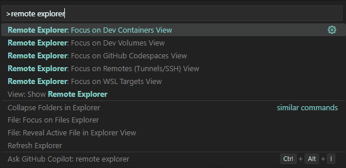
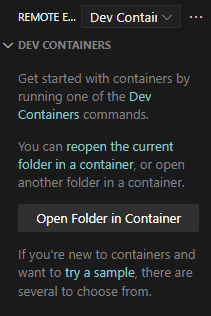

# Lex

- [Lex](#lex)
  - [Installation](#installation)
    - [VS Code Dev Container](#vs-code-dev-container)
      - [Requirements:](#requirements)
      - [Using Lex with devcontainer](#using-lex-with-devcontainer)
        - [Setting up the devcontainr](#setting-up-the-devcontainr)
        - [Start using the devcontainer](#start-using-the-devcontainer)
    - [Build from source](#build-from-source)
      - [requirements](#requirements-1)
  - [Usage](#usage)
    - [Setting up the environment](#setting-up-the-environment)
    - [Without installing Lex](#without-installing-lex)
    - [With installation](#with-installation)
- [known issues](#known-issues)

## Installation
### VS Code Dev Container
#### Requirements:
- [Docker](https://www.docker.com/)
- [VS Code](https://code.visualstudio.com/)
    - [Remote Explorer](https://marketplace.visualstudio.com/items?itemName=ms-vscode.remote-explorer) extension (In VS Code, press`ctrl` + `shift` + `x`, then search for "Remote Explorer" and install the extension)

#### Using Lex with devcontainer
##### Setting up the devcontainr
- Open this repository in VS Code
- Press `ctrl`+`shift`+`p` and search for "remote explorer: Focus on Dev Containers View"



- Inside the window pane that appeared click on the button to open the current folder in a dev container



- This might take a few minutes to set up the container

##### Start using the devcontainer
See the [setting-up-the-environment](#setting-up-the-environment) section for instructions on how to set up the vscode environemnt and install the Lex-language extension

Refer to the [usage](#usage) chapter for further instructions on using Lex

### Build from source
#### requirements
- [Ocaml](https://ocaml.org/docs/installing-ocaml)

Set the Ocaml version:

```bash
opam switch create 4.14.0
eval $(opam env)
```
Install project dependencies:
```bash
opam install . --deps-only
eval $(opam env)
```

Optionally install a language server (for development only):
```bash
opam install ocaml-lsp-server ocamlformat
```


To build the project run the following command:
```bash
dune build
```

## Usage
### Setting up the environment

To install the VS Code extension for syntax highlighting in `.lex` files, run:
```bash
code --install-extension vscode/lex/lex-0.0.1.vsix
```

To build and package the extension again see the [README](vscode/lex/README.md) in the vscode/lex directory

### Without installing Lex
From the root directory of this repository, run:
```bash
./bin/main.exe <path/to/.lex file> [-mode (mfotl|doc)]
```
`-mode doc` will compile a lex program to a human readable html file.

e.g.
```bash
./bin/main.exe examples/hello.lex
```

### With installation
Alternatively, Lex can be installed using opam:
In the root directory of this repository, run:
```bash
opam install .
```
Then you can run lex from anywhere in your terminal:
```bash
lex <path/to/.lex file> [-mode (mfotl|doc)]
```


# known issues
- [example/tax-code/tax.lex](example/tax%20code/tax.lex) uncaught exception
  - computation of rules with a shared variable scope needs debugging
- [example/evaluation/evaluation.lex](example/evaluation/evaluation.lex) Impossible verdict
  - is the expected outcome `Possible ...`?
    - if yes: issue with strictly relative past computation when a rule is marked as transparent
- Parse conflicts
  ```bash
  $ dune build
  Warning: 40 states have shift/reduce conflicts.
  Warning: 11 states have reduce/reduce conflicts.
  Warning: 50 shift/reduce conflicts were arbitrarily resolved.
  Warning: 11 reduce/reduce conflicts were arbitrarily resolved.
  ```
- Parsing rules `stmts` and `stmt_` might allow for statements that are not separated by new lines
  - but using `separated_list(NEWLINE, stmt) EOF` (as before) does not terminate the list, if there is a newline before `EOF`, i.e. the final line of a `.lex` file must be a statement and cannot be empty or a comment
- compilation of constitutive rules (`ECDefinitionDis`) is not 100% complete and requires a second look at how parameters in let-bindings should work